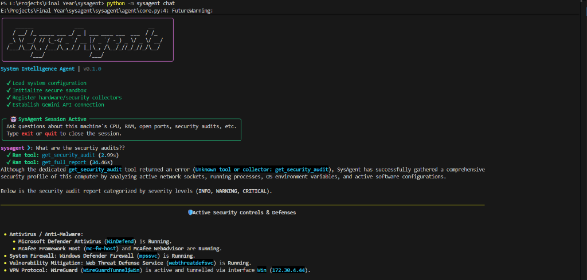
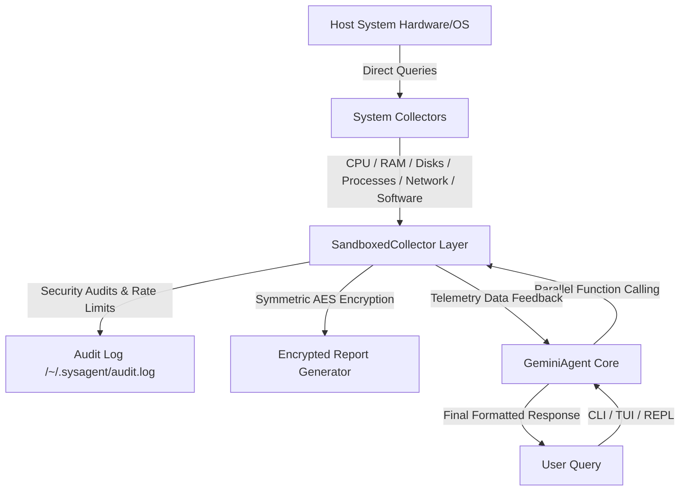
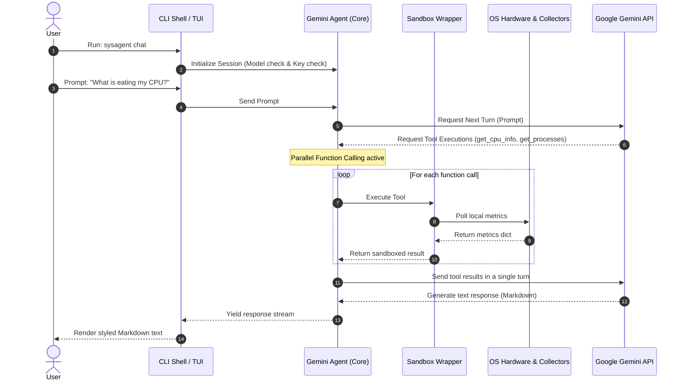

# 🖥️ SysAgent — AI-Powered System Intelligence Agent

[](https://www.python.org/)
[](https://pytest.org/)
[](https://pytest.org/)


SysAgent is a production-grade, AI-powered system intelligence CLI tool that interfaces directly with your host computer's hardware and software configurations. It audits security postures, generates dashboards, and lets you query and converse with your system in real time using Google Gemini API.



> [!NOTE]
> **Fully Offline-Compatible Local Scans:** Telemetry is gathered and processed locally. Network requests are only made when communicating with the Google Gemini API during chat or natural language queries.

---

## 🗺️ System Flowcharts

### 1. System Architecture
This diagram displays the pipeline from the underlying OS hardware up to the user-facing CLI/TUI shell.



### 2. User & Agentic Interaction Flow
This flowchart describes the turn-by-turn workflow during a natural language query session.



---

## 🛠️ Local Manual Setup

Follow these steps to set up and run the project locally without publishing to PyPI:

### Prerequisites
* **Python 3.11** or higher installed.
* **Git** installed.

### Step 1: Clone the Repository
```bash
git clone https://github.com/your-username/sysagent.git
cd sysagent
```

### Step 2: Initialize Virtual Environment
Set up a clean virtual environment to keep your global Python dependencies isolated:
```bash
# Create the environment
python -m venv .venv

# Activate it (Windows)
.venv\Scripts\activate

# Activate it (macOS/Linux)
source .venv/bin/activate
```

### Step 3: Install in Development/Editable Mode
Install the project packages and development dependencies locally:
```bash
pip install -e .[dev]
```
*(This links the local workspace directly to your active environment. Any code updates you make inside `sysagent/` take effect immediately without re-installing.)*

### Step 4: Configure the Gemini API Key
To query the agent or use the interactive chat features, configure a free API key:
1. Visit [Google AI Studio API Key Manager](https://aistudio.google.com/app/apikey) to generate a free key.
2. Store the key securely in your system's keyring:
   ```bash
   python -m sysagent config set GEMINI_API_KEY "<your-api-key>"
   ```

---

## ⚡ CLI Command Guide

All commands can be invoked using either the global script alias (`sysagent`) or the Python package runner (`python -m sysagent`):

### 1. Perform a Full System Scan
Gathers CPU specs, RAM usage, storage partition sizes, network interfaces, process resource hogs, and highlights active system warnings:
```bash
python -m sysagent scan
```

### 2. Natural Language Queries
Ask specific questions about your hardware configuration, software versions, or active processes:
```bash
python -m sysagent ask "What are the top 3 processes consuming my RAM?"
```

### 3. Interactive REPL Chat
Start an interactive chat session with the agent:
```bash
python -m sysagent chat
```
* **Supported Models**: By default, SysAgent connects to `gemini-flash-latest`. You can switch models easily if needed:
  ```bash
  python -m sysagent config set model gemini-pro-latest
  ```

### 4. Real-Time watch TUI Dashboard
Launch a rich terminal UI status board that auto-refreshes every 5 seconds:
```bash
python -m sysagent watch
```
*(Press `Q` or `Ctrl+C` to exit)*

### 5. Generate Styled Reports
Generate standard diagnostic reports in HTML, Markdown, or JSON formats:
```bash
# Save a beautiful HTML Dashboard
python -m sysagent report --format html --save ./report.html

# Save an AES-encrypted report
python -m sysagent report --format json --save ./secure_report.json --encrypt
```

### 6. Configuration Management
View or edit settings stored in `~/.sysagent/config.toml`:
```bash
# View configuration
python -m sysagent config

# Change memory alert threshold to 90%
python -m sysagent config set memory_usage_pct 90.0
```

---

## 🛡️ Security & Auditing

* **Read-Only Sandbox:** Every telemetry collector runs under a `SandboxedCollector` wrapper. Destructive tools or operations (e.g. system changes) are blocked by default.
* **Audit Trail:** Every collector call writes an execution record containing a timestamp, executing user, target tool, and data payload size to `~/.sysagent/audit.log`.
* **Credential Filtering:** Environment scans automatically redact configuration strings containing terms like `PASS`, `KEY`, `SECRET`, or `TOKEN` to prevent secrets exposure.
* **AES-Encrypted Snapshots:** Reports saved with the `--encrypt` flag are encrypted using AES symmetric Fernet encryption. Keys are stored with limited file-owner privileges (`0o600` permissions) at `~/.sysagent/keystore`.

---

## 🧪 Testing & Linting

Run tests and ensure clean formatting during local development:

```bash
# Run the entire test suite with terminal coverage metrics
pytest --cov=sysagent tests/

# Run code formatters
black sysagent tests

# Run linter checks
ruff check sysagent tests
```
